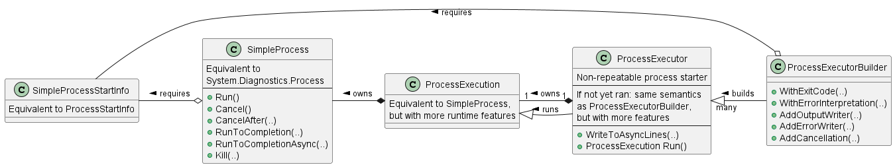

# Kenet.SimpleProcess

This library is a tiny wrapper around `System.Diagnostics.Process`. In the past I faced often the problem, that it was not easy and reliable to grab the output stream for a process without potencially producing a dead lock. To eliminate this and reduce the overall boilerplate for capturing the output or error stream of a process, I have forged the library.

## Features

- Main support for .NET Standard 2.0
- Tested for .NET 4.8, .NET Core 3.1 and .NET 5.0
- Core classes are thread-safe
- Synchronous and asynchronous API surface
- Support for reading output line by line
- Process lifecycle: Started -> Cancelled | Exited
- Prevents typically occurring dead-lock situations
- Most essential and top standing dependencies

## Architecture



In the diagram you see `SimpleProcess`, the heart of the library. It follow the same semantics like `System.Diagnostics.Process`.

A `ProcessExecution` represents exactly this, a running process execution. In contrast to `SimpleProcess`, it has advanced runtime features, for example can it validate the exit code and throw `BadExitCodeException` in case of failing exit code validation. Optionally, the exception can include the error output from the process, if enabled.

You cannot reuse the `ProcessExecutor` too. But when you create an instance of it, then the process is not yet started. You have the chance to tweak the to be started process, because the executor gets sealed once executing.

The `ProcessExecutorBuilder` is the builder for instances of `ProcessExecutor`.

## Usage

Most convenient way to spin up a process and grab its output line by line:

```
var startInfo = SimpleProcessStartInfo.NewBuilder("git")
    .WithArguments($"log --oneline -2")
    .WithWorkingDirectory(AppContext.BaseDirectory)
    .Build(); // Or alternatively you can use the record init feature

using var execution = ProcessExecutorBuilder.CreateDefault(startInfo)
    .Build()
    .WriteToAsyncLines(x => x.AddOutputWriter, out var asyncLines)
    .Run(); // Starts the process, but does not wait for completion

// This waits implicitly for completion.
// It may throw an exception if the process gets cancelled.
var lines = await asyncLines.ToListAsync();

// 'lines' is equivalent to: (without #. "")
// 0. "b984dd7 Added builder for SimpleProcessStartInfo"
// 1. "7a4902c Tiny refactoring done"
// 2. ""

// At this point the process already exited.
```

## Limitations

This library is just a simple process wrapper and does not cover the full `System.Diagnostics.Process`-API. Therefore it does not support:

- process reattach functionality
- standard input handling
  
## License

This project is licensed under the MIT License - see the [LICENSE](LICENSE) file for details.